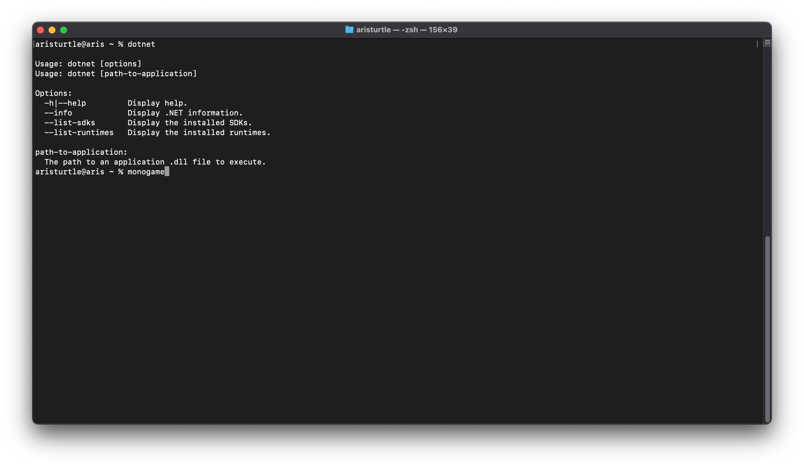
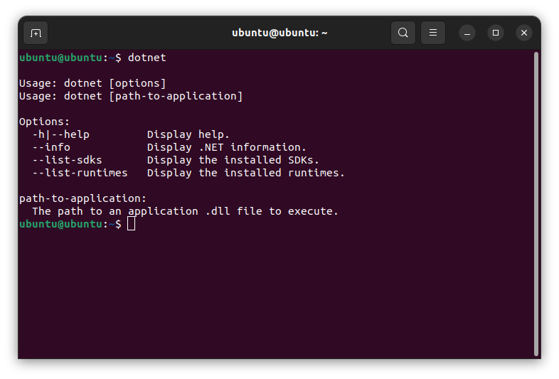
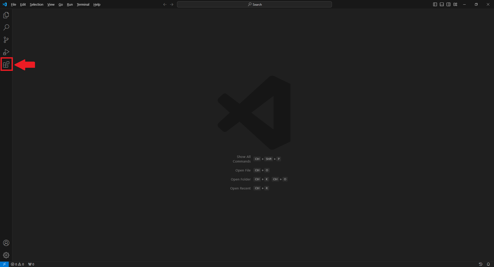

# Setting up your development environment for VSCode

This is a guide on setting up your development environment for creating games with MonoGame using Visual Studio Code. By following this guide, you will learn how to install the necessary .NET SDK for developing C# applications, set up MonoGame C# templates for new projects, and configure Visual Studio Code with recommended extensions for C# development. By the end, you'll be fully equipped to start creating games with MonoGame using Visual Studio code. 

> [!NOTE]
> The only development environment that MonoGame officially supports on Linux is [Visual Studio Code](https://code.visualstudio.com/).
>
> [Visual Studio for Mac will be discontinued](https://devblogs.microsoft.com/visualstudio/visual-studio-for-mac-retirement-announcement/) by Microsoft in August 2024.  At that time, [Visual Studio Code](https://code.visualstudio.com/) will be the only development environment supported by MonoGame on macOS.

## Install .NET 8 SDK
To develop with C#, you will need to install the .NET SDK.  At the time of this writing, the current version is .NET 8.0.  You can follow the instructions below based your operating system to install the .NET 8.0 SDK

> [!NOTE]
> The current version of MonoGame (3.8.1.303) targets .NET 6.0.  Regardless you can, and it is recommended to, use .NET 8.0.  The only requirement for having .NET 6.0 installed is if you are developing extensions for the MGCB Editor.

# [Windows](#tab/windows)
1. Navigate to [https://dotnet.microsoft.com/en-us/download](https://dotnet.microsoft.com/en-us/download)


2. Click the **.NET SDK x64** download button to download.  This will take you to the download page where the **dotnet-sdk-8.x.yyy-win-x64.exe** will download.
3. When the download completes, run the **dotnet-sdk-8.x.yyy-win-x64.exe** installer and complete the steps to install .NET on your machine.
4. When the install completes, open a new **Command Prompt** window and run the command `dotnet` to verify the installation was successful.


# [macOS](#tab/macos)
1. Navigate to [https://dotnet.microsoft.com/en-us/download](https://dotnet.microsoft.com/en-us/download)


2. Download the .NET SDK x64-(Intel) Installer

> [!NOTE]
> For the time being, MonoGame requires that you install the **.NET SDK x64-(Intel)** version of the .NET SDK even if you are running on an Apple Silicon (M1/M2) Mac.  For Apple Silicon Macs, it also requires that [Rosetta](https://support.apple.com/en-us/HT211861) is enabled.

3. Once the installation **.pkg** file finishes downloading, run it and follow the prompts to install the .NET SDK


4. Once the installation is complete, open a new terminal window and run the command `dotnet` to verify the installation was successful.



# [Linux](#tab/linux)
1. Open a new **Terminal** window.
2. Enter the following command in the terminal to download the **dotnet-install.sh**

```sh
wget https://dot.net/v1/dotnet-install.sh -O dotnet-install.sh
```

3. Grant permission for the script to execute by entering the following command in the terminal:

```sh
chmod +x ./dotnet-install.sh
```

4. Run the script to install the .NET 8 SDK by entering the following command in the terminal:

```sh
./dotnet-install.sh
```


5. You will now need to setup your environment variables so that the `dotnet` command is recognized.  To do this, open the file `~/.bashrc` in a text editor and add the following lines to the end of the file.

```sh
export DOTNET_ROOT=$HOME/.dotnet
export PATH=$PATH:$DOTNET_ROOT:$DOTNET_ROOT/tools
```


6. Save and close the file, close any open terminal windows, then open a new terminal window so the new environment variables are registered.
7. Enter the `dotnet` command to validate that the .NET 8 SDK is now installed.



---

> [!TIP]
> If you intend to target mobile platforms, you will also need to install the corresponding workloads.  Enter the following commands in a command prompt/terminal
>
> ```sh
> dotnet workload install ios
> dotnet workload install android
> ```

## Install MonoGame Templates
The .NET SDK installation provides the default C# project templates but does not include the MonoGame templates. These templates must be installed manually.

1. Open a new terminal window (**Command Prompt** on Windows).

```sh
dotnet new install MonoGame.Templates.CSharp
```


> [!NOTE]
> When installing the templates, you will see an error about the UWP template failing to install.  You can ignore this error, the UWP templates are deprecated and will be removed in a future MonoGame release.

## Install Visual Studio Code

# [Windows](#tab/windows)
1. Open your web browser and navigate to [https://code.visualstudio.com/](https://code.visualstudio.com/).


2. Click the **Download for Windows** button.  This will redirect you to the download page where the installer will automatically download.
3. When the download completes, run the installer and complete the steps to install Visual Studio Code.

# [macOS](#tab/macos)
1. Open your web browser and navigate to [https://code.visualstudio.com/](https://code.visualstudio.com/).


2. Click the **Download Mac Universal** button.  This will redirect you to the page where the application archive (.zip) file will begin downloading.
3. Extract the contents of the VSCode archive that downloaded by double-clicking it inside a Finder window.  This will extract the **Visual Studio Code.app** file.
4. Drag the **Visual Studio Code.app** file into the **Applications** folder, making it available in the macOS Launchpad.

# [Linux](#tab/linux)
The recommended method for installing Visual Studio Code in Linux is to use Snap. This is supported by most Linux distributions.

- [Snap Package](https://code.visualstudio.com/docs/setup/linux#_snap)

There are also individual guides below based on your Linux distribution if you do not want to use Snap:

- [Debian and Ubuntu base distributions](https://code.visualstudio.com/docs/setup/linux#_debian-and-ubuntu-based-distributions)
- [RHEL, Fedora, and CentOS based distributions](https://code.visualstudio.com/docs/setup/linux#_rhel-fedora-and-centos-based-distributions)
- [openSUSE and SLE-based distributions](https://code.visualstudio.com/docs/setup/linux#_opensuse-and-slebased-distributions)
- [AUR package for Arch Linux](https://code.visualstudio.com/docs/setup/linux#_aur-package-for-arch-linux)
- [Installing .rpm package manually](https://code.visualstudio.com/docs/setup/linux#_installing-rpm-package-manually)

---

## Install Visual Studio Code C# Extensions
To transform Visual Studio Code from a simple text editor into a powerful development environment for C# projects, you must install the Visual Studio Code C# extension. This extension enhances the editor by providing syntax highlighting, code analysis, IntelliSense, and other features that significantly improve the development experience and productivity when working with C#.

1. Open Visual Studio Code.
2. Click the **Extensions** icon in the **Activity Bar** on the left.



3. In the **Search Box** type `C#`.
4. Click **Install** for the **C# Dev Kit** extension.  Installing this will also install the base **C#** extension.


---

## Setup Wine For Effect Compilation
Effect (shader) compilation requires access to DirectX.  This means it will not work natively on macOS and Linux systems, but it can be used through [Wine](https://www.winehq.org/).

# [Windows](#tab/windows)
> [!NOTE]
> Windows users do not require an additional setup for effect compilation and can skip this section.

# [macOS](#tab/macos)
MonoGame
MonoGame provides a setup script that can be executed to setup the Wine environment for Effect (shader) compilation.  However, this script has the following prerequisites that must first be setup
- **curl** must be installed
- **p7zip** must be installed
- **wine-stable** must be installed.

These can be installed using **brew**.

1. Open a terminal window.
2. Enter the following command:

```sh
brew install p7zip curl
brew install --cask wine-stable
```

> [!CAUTION]
> It is recommended that you use `wine-stable` and not `wine-staging`.

3. Now that the prerequisites are installed, download the [mgfxc_wine_setup.sh](https://raw.githubusercontent.com/MonoGame/MonoGame/master/Tools/MonoGame.Effect.Compiler/mgfxc_wine_setup.sh) script and execute it by entering the following command in the terminal:

```sh
wget -qO- https://monogame.net/downloads/net6_mgfxc_wine_setup.sh | bash
```

This will create new directory called `.winemonogame` in your home directory.  If you ever wish to undo the setup this script performed, just simply delete that directory.

# [Linux](#tab/linux)
MonoGame provides a setup script that can be executed to setup the Wine environment for Effect (shader) compilation.  However, this script has the following prerequisites that must first be setup
- **curl** must be installed
- **p7zip** must be installed
- **wine64** must be installed.

For Debian-based distributions like Ubuntu, you can perform the following:

1. Open a terminal window
2. Enter the following command

```sh
sudo apt install curl p7zip-full wine64
```

> [!TIP]
> If you receive an error stating that either of the packages do not have an install candidate, you may need to enable the universe apt repository.  To do this, enter the following commands in the terminal
>
> ```sh
> sudo add-apt-repository universe
> sudo apt update
> ```
>
> Then try installing the packages again.

> [!CAUTION]
> If you plan to install Wine using the `winehq-*` package instead, it is recommended that you use the `winehq-stable` package and not `-staging`.

3. Now that the prerequisites are installed, download the [mgfxc_wine_setup.sh](https://raw.githubusercontent.com/MonoGame/MonoGame/master/Tools/MonoGame.Effect.Compiler/mgfxc_wine_setup.sh) script and execute it by entering the following command in the terminal:

```sh
wget -qO- https://monogame.net/downloads/net6_mgfxc_wine_setup.sh | bash
```

This will create new directory called `.winemonogame` in your home directory.  If you ever wish to undo the setup this script performed, just simply delete that directory.

---

## Apple Silicon Known Issues
There is currently a two known issue when building content on an Apple Silicon (M1/M2) Mac:

1. **Building Textures**: An exception occurs stating that the **freeimage** lib could not be found.
2. **Building SpriteFonts**: An exception occurs stating that the **freetype** lib could not be found.

These issue occur due to needing compiled versions of these libs for the M1/M2 architecture.  [There is currently work being done to resolve this](https://github.com/MonoGame/MonoGame/issues/8124), however in the meantime you can use the following workaround that has been provided by community members.

1. Open a terminal and install **freeimage** and **freetype** using **brew**

```sh
brew install freeimage freetype
```

2. (Optional) Create the `/usr/local/lib/` directory if it does not exist

```sh
mkdir /usr/local/lib/
```

3. Symlink both **freeimage** and **freetype** to the `/usr/local/lib/` directory

```sh
sudo ln -s /opt/homebrew/lib/libfreetype.6.dylib /usr/local/lib/libfreetype.6.dylib
sudo ln -s /opt/homebrew/lib/libfreeimage.3.18.0.dylib /usr/local/lib/libfreeimage.dylib
```

## Conclusion
By following this guide, you have successfully set up your development environment for game development with MonoGame using Visual Studio Code. You've installed the .NET SDK, added MonoGame project templates, and configured Visual Studio Code with the necessary C# extensions. Now, you're ready to start creating your games! [Continue to the next section to create your first project and begin development](2_creating_a_new_project_netcore.md).