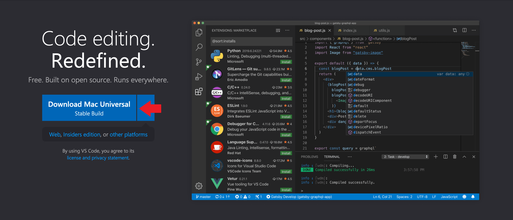

This is a guide on setting up your development IDE for creating games with MonoGame using Visual Studio Code. By following this guide, you will learn how to install the necessary tools for developing C# applications and configure Visual Studio Code with recommended extensions for C# development.

By the end, you will be fully equipped to start creating games with MonoGame using Visual Studio code.

> [!IMPORTANT]
> The only development environment that MonoGame officially supports on Mac/Linux is [Visual Studio Code](https://code.visualstudio.com/).
>
> [Visual Studio for Mac will be discontinued](https://devblogs.microsoft.com/visualstudio/visual-studio-for-mac-retirement-announcement/) by Microsoft in August 2024.  At that time, [Visual Studio Code](https://code.visualstudio.com/) will be the only development environment supported by MonoGame on macOS.

## Install MonoGame Templates

The .NET SDK installation provides the default C# project templates but does not include the MonoGame templates. These templates must be installed manually.

1. Open a new terminal window (**Command Prompt** on Windows).

    ```sh
    dotnet new install MonoGame.Templates.CSharp
    ```

    

    > [!NOTE]
    > When installing the templates, an error message may appear regarding the UWP template failing to install. This error can be safely ignored, as the UWP templates are deprecated and will be removed in a future MonoGame release.

## Install Visual Studio Code

### [Windows](#tab/windows)

1. Open your web browser and navigate to [https://code.visualstudio.com/](https://code.visualstudio.com/).

    

2. Click the **Download for Windows** button.  This will redirect you to the download page where the installer will automatically download.
3. When the download completes, run the installer and complete the steps to install Visual Studio Code.

### [macOS](#tab/macos)

1. Open your web browser and navigate to [https://code.visualstudio.com/](https://code.visualstudio.com/).

    

2. Click the **Download Mac Universal** button.  This will redirect you to the page where the application archive (.zip) file will begin downloading.
3. Extract the contents of the VSCode archive that downloaded by double-clicking it inside a Finder window.  This will extract the **Visual Studio Code.app** file.
4. Drag the **Visual Studio Code.app** file into the **Applications** folder, making it available in the macOS Launchpad.

### [Linux](#tab/linux)

The recommended method for installing Visual Studio Code in Linux is to use Snap. This is supported by most Linux distributions.

- [Snap Package](https://code.visualstudio.com/docs/setup/linux#_snap)

There are also individual guides below based on your Linux distribution if you do not want to use Snap:

- [Debian and Ubuntu base distributions](https://code.visualstudio.com/docs/setup/linux#_debian-and-ubuntu-based-distributions)
- [RHEL, Fedora, and CentOS based distributions](https://code.visualstudio.com/docs/setup/linux#_rhel-fedora-and-centos-based-distributions)
- [openSUSE and SLE-based distributions](https://code.visualstudio.com/docs/setup/linux#_opensuse-and-slebased-distributions)
- [AUR package for Arch Linux](https://code.visualstudio.com/docs/setup/linux#_aur-package-for-arch-linux)
- [Installing .rpm package manually](https://code.visualstudio.com/docs/setup/linux#_installing-rpm-package-manually)

---

## Install Visual Studio Code C# Extensions

To transform Visual Studio Code from a simple text editor into a powerful development environment for C# projects, you must install the Visual Studio Code C# extension. This extension enhances the editor by providing syntax highlighting, code analysis, IntelliSense, and other features that significantly improve the development experience and productivity when working with C#.

1. Open Visual Studio Code.
2. Click the **Extensions** icon in the **Activity Bar** on the left.

    

3. In the **Search Box** type `C#`.
4. Click **Install** for the **C# Dev Kit** extension.  Installing this will also install the base **C#** extension.


---

## Apple Silicon Known Issues

> [!IMPORTANT]
> Please see the [Apple Silicon Known Issues](./1_setting_up_your_os_for_development_macos.md#apple-silicon-known-issues) section in the [MacOS guide](./1_setting_up_your_os_for_development_macos.md) guide for help in resolving content build issues.
>
> This is only temporary a we are working in a "Fast Follow" release which will greatly improve and simplify content building on Mac/Linux

---

## Next Steps

Next, get to know MonoGame by creating your first game project:

- [Creating a new project](3_creating_a_new_project_netcore.md)
