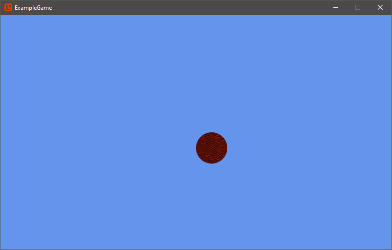
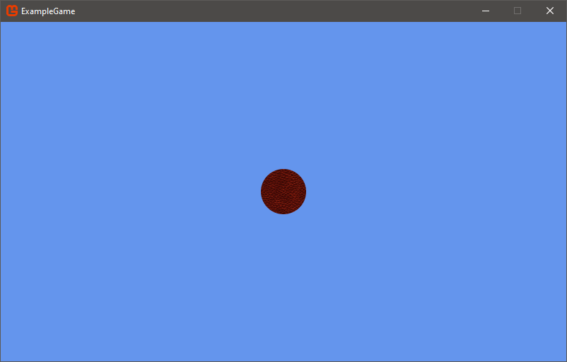

> [!NOTE]
> this tutorial continues from where [5. Adding Content](4_adding_content.md) left off.

## Positioning the content

First, you need to add few new variables in the `Game1.cs` class file: A `Vector2` for position and a `float` for speed.

```csharp
    public class Game1 : Game
    {
        _graphics = new GraphicsDeviceManager(this);
        Content.RootDirectory = "Content";
        Texture2D ballTexture;
        Vector2 ballPosition;
        float ballSpeed;
    }
```

Next, you need to initialize them. Find the `Initialize` method and add the following lines.

```csharp
    protected override void Initialize()
    {
        // TODO: Add your initialization logic here
        ballPosition = new Vector2(_graphics.PreferredBackBufferWidth / 2,
                                   _graphics.PreferredBackBufferHeight / 2);
        ballSpeed = 100f;
        
        base.Initialize();
    }
```

With this, you are setting the ball's starting position to the center of the screen based on the dimensions of the screen determined by the current `BackBufferWidth` and `BackBufferHeight` that was obtained from the `Graphics Device` (the current resolution the game is running at).

Lastly, change the `Draw` method to draw the ball at the correct position.  Find the `Draw` method and update the `spriteBatch.Draw` call to:

```csharp
_spriteBatch.Draw(ballTexture, ballPosition, Color.White);
```

Now run the game.



As you can see, the ball is not quite centered yet. That is because the default `origin` of a texture is its `top-left corner`, or `(0, 0)` relative to the texture. The ball texture is drawn with its top-left corner exactly centered, rather than its actual center. You can specify a different origin when drawing, as shown in the following code snippet. The new origin takes into account the height and width of the image when drawing:

```csharp
_spriteBatch.Draw(
    ballTexture,
    ballPosition,
    null,
    Color.White,
    0f,
    new Vector2(ballTexture.Width / 2, ballTexture.Height / 2),
    Vector2.One,
    SpriteEffects.None,
    0f
);
```

> [!NOTE]
> For more details on drawing textures, check out the [How To Draw a Sprite](../getting_to_know/howto/graphics/HowTo_Draw_A_Sprite.md) series which goes in to greater detail.

This change adds a few extra parameters to the spriteBatch.Draw call, but do not worry about that for now. This new code sets the actual center `(width / 2 and height / 2)` of the image as its origin (drawing point).

Now the image will get drawn to the center of the screen.



## Getting user input via keyboard

Time to set up some movement. Find the `Update` method in the `Game1.cs` class file and add:

```csharp
    protected override void Update(GameTime gameTime)
    {
        if (GamePad.GetState(PlayerIndex.One).Buttons.Back == ButtonState.Pressed || 
                             Keyboard.GetState().IsKeyDown(Keys.Escape))
            Exit();

        // TODO: Add your update logic here

        // The time since Update was called last.
        float updatedBallSpeed = ballSpeed * (float)gameTime.ElapsedGameTime.TotalSeconds;

        var kstate = Keyboard.GetState();
        
        if (kstate.IsKeyDown(Keys.Up))
        {
            ballPosition.Y -= updatedBallSpeed;
        }
        
        if (kstate.IsKeyDown(Keys.Down))
        {
            ballPosition.Y += updatedBallSpeed;
        }
        
        if (kstate.IsKeyDown(Keys.Left))
        {
            ballPosition.X -= updatedBallSpeed;
        }
        
        if (kstate.IsKeyDown(Keys.Right))
        {
            ballPosition.X += updatedBallSpeed;
        }
        
        base.Update(gameTime);
    }
```

The following is a line-by-line analysis of the above code.

### Calculating speed based on framerate

```csharp
float updatedBallSpeed = ballSpeed * (float)gameTime.ElapsedGameTime.TotalSeconds;
```

This code caches how much time, in seconds, since the last `Update` call was run, which gives us the duration of a single frame drawn to the screen.  This is then multiplied by the `ballSPeed` value to allow us to control just how fast the ball moves each frame.

The reason why `ballSpeed` is multiplied by `gameTime.ElapsedGameTime.TotalSeconds` is because, when not using fixed time step, the time between Update calls varies. To account for this, the ballSpeed is multiplied by the amount of time that has passed since the last Update call. The result is that the ball appears to move at the same speed regardless of what framerate the game happens to be running at.

> [!NOTE]
> Try experimenting with what happens if you do not multiply the `ballSpeed` by `gameTime.ElapsedGameTime.TotalSeconds`, to see the difference it makes.

### Getting Keyboard state

```csharp
var kstate = Keyboard.GetState();
```

This code fetches the current keyboard state (`Keyboard.GetState()`) and stores it into a variable called `kstate`.

### Checking Keyboard state

```csharp
if (kstate.IsKeyDown(Keys.Up))
```

This line checks to see if the `Up Arrow` key is pressed.

### Updating the graphics position to draw to

```csharp
    ballPosition.Y -= updatedBallSpeed;
```

If the `Up Arrow` key is pressed, the ball moves using the value you assigned to by the calculated `ballSpeed` variable.

The rest of the lines of code do the same thing but for the `Down`, `Left` and `Right` Arrow keys, and down, left, and right movement, respectively.

If you run the game, you should be able to move the ball with the arrow keys.

## Getting user input via Joystick / GamePad

Another option for user input is the <xref:Microsoft.Xna.Framework.Input.Joystick> or <xref:Microsoft.Xna.Framework.Input.GamePad> classes. Setting up input for Joysticks and GamePads is very similar to setting up keyboard input, the following example is designed while using a single joystick connected to the host, to support more, you will need to evaluate all the connected joysticks and read their input (see <xref:Microsoft.Xna.Framework.Input.JoystickState#Microsoft_Xna_Framework_Input_JoystickState_IsConnected> for reference).

Find the `Update` method in the Game1.cs class file and add:

```csharp
if(Joystick.LastConnectedIndex == 0)
{
    JoystickState jstate = Joystick.GetState(PlayerIndex.One);

    float updatedBallSpeed = ballSpeed * (float)gameTime.ElapsedGameTime.TotalSeconds;

    if (jstate.Axes[1] < 0)
    {
        ballPosition.Y -= updatedBallSpeed;
    }
    else if (jstate.Axes[1] > 0)
    {
        ballPosition.Y += updatedBallSpeed;
    }

    if (jstate.Axes[0] < 0)
    {
        ballPosition.X -= updatedBallSpeed;
    }
    else if (jstate.Axes[0] > 0)
    {
        ballPosition.X += updatedBallSpeed;
    }
}
```

The following is a line-by-line analysis of the above code.

### Check Joysticks connection state

```csharp
if(Joystick.LastConnectedIndex == 0)
```

This code assumes that we have a single controller plugged into our device. `LastConnectedIndex` is the index of the last connected controller. The default is `-1`, which would mean no controller is plugged in.
If there is no controller, the code inside the if statement will be skipped over.

### Get the current state of Joystick 1

```csharp
JoystickState jstate = Joystick.GetState(0);
```

This code fetches the current first joystick state `Joystick.GetState(0)` and stores it into a variable called `jstate`.

### CHeck the current value of "Axis" 2

```csharp
if (jstate.Axes[1] < 0)
```

This line checks whether the "second" `Joystick axis` is less than 0.

> [!NOTE]
> The Joystick class stores multiple axis of direction for anything with an integer based range. For any number of 2D axis sticks, it stores it in an x,y format inside of an integer array.

The axis of movement for 2D joysticks goes from `-32768` to `32768` on most modern controllers. Aiming the Joystick upwards results in a negative value on the `Y-axis` (Axes[1]).

The rest of the lines of the code do the same thing but for their relevant x and y directions.

If you run the game, you should be able to move the ball with the left Joystick on your controller if one is plugged in.  For GamePads, just use the `GamePad` versions of the same `JoyStick` classes, but remember, GamePads usually have multiple "sticks" for the left and right hand sides of the controller.

## Handling "Dead Zones" with Joysticks/GamePads

You will probably notice that the ball slightly moves on its own when controlled via a JoyStick or GamePad, which is likely be the result of your Joystick having a slight drift, a common scenario. You can fix that by adding a `deadzone` and changing the conditions to use this `deadzone` (a value range that needs to be exceeded in order to "act" on the Joystick/Keyboard input).

```csharp
public class Game1 : Game
{
    ...
    Texture2D ballTexture;
    Vector2 ballPosition;
    float ballSpeed;

    int deadZone;
```

Next, you need to initialize the deadzone. Find the `Initialize` method and add the following line.

```csharp
deadZone = 4096;
```

Now, replace the conditions for the Joystick movement in `Update` to the following:

```csharp
if (jstate.Axes[1] < -deadZone)
{
    ballPosition.Y -= updatedBallSpeed;
}
else if (jstate.Axes[1] > deadZone)
{
    ballPosition.Y += updatedBallSpeed;
}

if (jstate.Axes[0] < -deadZone)
{
    ballPosition.X -= updatedBallSpeed;
}
else if (jstate.Axes[0] > deadZone)
{
    ballPosition.X += updatedBallSpeed;
}
```

If you run the game and move the Joystick around, you should notice that your Joystick has to move a decent distance before the ball starts moving. This is what a deadZone does, it allows for there to be a minimum distance before the input is reflected in the game.

> [!NOTE]
> Try experimenting with what happens when you change the value of the deadZone. Mess around and find an amount that fits your project.

## Handling screen borders

You will probably notice that the ball is not confined to the window. You can fix that by setting bounds onto the ballPosition after it has already been moved to ensure it cannot go further than the width or height of the screen.

```csharp
if (kstate.IsKeyDown(Keys.Right))
{
    ballPosition.X += updatedBallSpeed;
}

if (ballPosition.X > _graphics.PreferredBackBufferWidth - ballTexture.Width / 2)
{
    ballPosition.X = _graphics.PreferredBackBufferWidth - ballTexture.Width / 2;
}
else if (ballPosition.X < ballTexture.Width / 2)
{
    ballPosition.X = ballTexture.Width / 2;
}

if (ballPosition.Y > _graphics.PreferredBackBufferHeight - ballTexture.Height / 2)
{
    ballPosition.Y = _graphics.PreferredBackBufferHeight - ballTexture.Height / 2;
}
else if (ballPosition.Y < ballTexture.Height / 2)
{
    ballPosition.Y = ballTexture.Height / 2;
}

base.Update(gameTime);
```

Now run the game to test for yourself that the ball cannot go beyond the window bounds any more.

Happy Coding ^^

---

## Next Steps

We recommend browsing through the [Getting to know MonoGame](../getting_to_know/index.md) section to learn more and get some tips and tricks from the MonoGame team.

- [Getting to know MonoGame](../getting_to_know/index.md)
- [What Is articles](../getting_to_know/whatis/index.md)
- [How To articles](../getting_to_know/howto/index.md)

## Further Reading

Check out the [Tutorials section](../tutorials.md) for many more helpful guides and tutorials on building games with MonoGame.  We have an expansive library of helpful content, all provided by other MonoGame developers in the community.

Additionally, be sure to check out the official [MonoGame Samples](../samples.md) page for fully built sample projects built with MonoGame and targeting our most common platforms.
