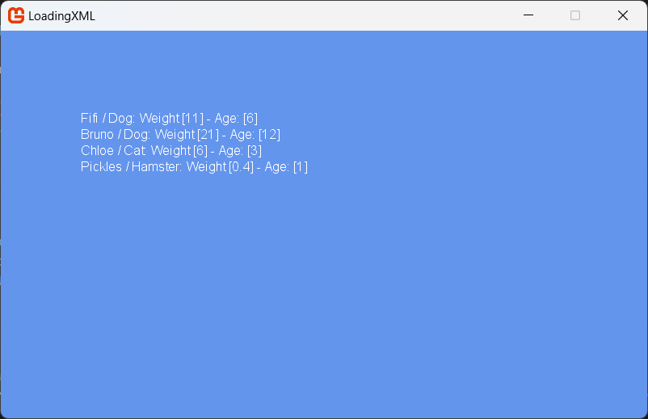

This example concludes the procedure begun in the tutorial [Adding an XML Content File to a Visual Studio Project](HowTo_Add_XML.md).

Once custom game data is integrated as game content from an XML file through the Content Pipeline, it exists within your game runtime package in binary format. The data can be [loaded at runtime](HowTo_GameContent_Add.md) through the [ContentManager](xref:Microsoft.Xna.Framework.Content.ContentManager).

> [!IMPORTANT]
> This tutorial assumes you are using Visual Studio as your IDE, for VSCode please adapt the IDE interactions appropriately.

## Add a SpriteFont for testing

While not essential for loading XML, in order to demonstrate the loaded data and write it to the screen, we will add a [SpriteFont](xref:Microsoft.Xna.Framework.Graphics.SpriteFont) to enable the drawing of strings.

1. In the `Solution Explorer`, Double-click the `Content.mgcb` in the `Content` folder to open the MGCB editor.

    > [!TIP]
    > If you have any issues opening the MGCB content project, please refer to the [How to load content](HowTo_GameContent_Add.md) guide.

2. Click on `Edit -> New Item`, then name the file `Font` and select `SpriteFont Description` as the type.  Click on `Create` to finish.

3. Save the content project and then continue.

## To load the custom data in the game

1. To add the `MyDataTypes` library as a reference in the game project, In the `Solution Explorer`, right-click the game project, click `Add Reference`, click the `Projects` tab, select `MyDataTypes`, and then click `OK`.

2. Then in the `Solution Explorer`, double-click `Game1.cs` to edit it.

3. Add the `using` declaration for the MyDataTypes namespace at the top of the file beneath the existing `usings` statements.

    ```csharp
    using MyDataTypes;
    ```

4. Add a data declaration for an array of type `PetData` after the other `private` variables in the `Game1` class.

    ```csharp
    private PetData[] pets;
    ```

5. In the [Game.LoadContent](xref:Microsoft.Xna.Framework.Game#Microsoft_Xna_Framework_Game_LoadContent) override function, load the custom content.

    ```csharp
    protected override void LoadContent()
    {
        // Load the pet data table
        pets = Content.Load<PetData[]>("pets");
    }
    ```

    The custom game data now resides in the array of `PetData` objects.

6. The data loaded from the XML file into the `PetData` array can be accessed normally as c# code, for example, the following `Draw` code will render the data from the XML file to the screen if found, else it will write a warning.

    ```csharp
        protected override void Draw(GameTime gameTime)
        {
            GraphicsDevice.Clear(Color.CornflowerBlue);

            _spriteBatch.Begin();
            // Check if the XML data was loaded into the pets data array.
            if (pets != null)
            {
               // For each pet, write its data to the screen.
               for (int i = 0; i < pets.Length; i++)
                {
                    var pet = pets[i];
                    _spriteBatch.DrawString(Content.Load<SpriteFont>("Font"), $"{pet.Name} / {pet.Species}: Weight [{pet.Weight}] - Age: [{pet.Age}]", new Vector2(100, 100 + 20 * i), Color.White);
                }
            }
            else
            {
                // If no data was loaded (or there was an error) write `No Pets found` to the screen.
                _spriteBatch.DrawString(Content.Load<SpriteFont>("Font"), "No pets found", new Vector2(100, 100), Color.White);
            }
            _spriteBatch.End();
            base.Draw(gameTime);
        }
    ```

The result of loading the XML and rendering the data should display as follows:



## See Also

- [Using an XML File to Specify Content](HowTo_UseCustomXML.md)  
- [Adding Content to a Game](HowTo_GameContent_Add.md)  
