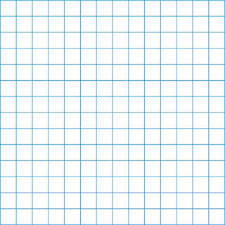
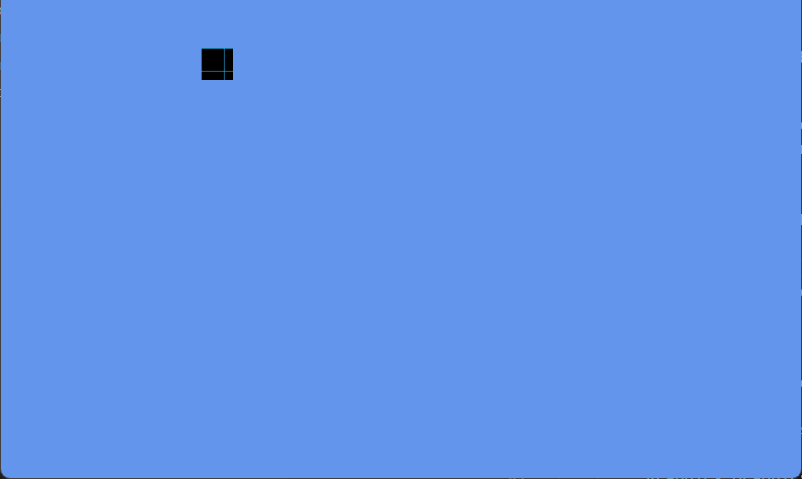

## Overview

The example is very basic but the principles are the same, when drawing to a Render Texture we apply the following process.

1. Set the Graphics Device to output to a texture.
2. Clear the buffer (or not depending on the use case).
3. Draw the full screen contents required in the Render Texture, e.g. a map or camera view.
4. Reset the Graphics device to the back buffer (screen).
5. Draw your game as normal.
6. Draw the Render Texture to the screen in the position we desire (e.g. in the lower corner for a mini-map), most likely on top of your game graphics.

> [!TIP]
> The technique is very useful, especially if you are doing split-screen gaming and need to draw multiple camera views.

## Requirements

This sample uses a `grid` texture (available below) to draw to the [RenderTarget2D](xref:Microsoft.Xna.Framework.Graphics.RenderTarget2D) before then rendering the contents of the `Render Target` to the screen as a texture.



Download the `Grid` texture and add it to your `Content Project` for this example. (see [How to Add Content](../content_pipeline/HowTo_GameContent_Add.md) for more information on this.)

## Creating a Render Target

1. Declare variables for a render target using the [RenderTarget2D](xref:Microsoft.Xna.Framework.Graphics.RenderTarget2D) class, for this example we will also be using a [Texture2D](xref:Microsoft.Xna.Framework.Graphics.Texture2D) for the "grid" texture we will output to the `Render Target`.

    ```csharp
    private GraphicsDeviceManager graphics;
    private SpriteBatch spriteBatch;
    private Texture2D grid;
    private RenderTarget2D renderTarget;
    ```

2. Load the "grid" texture, which contains vertical and horizontal lines.

    ```csharp
    protected override void LoadContent()
    {
        // Create a new SpriteBatch, which can be used to draw textures.
        spriteBatch = new SpriteBatch(GraphicsDevice);

        // using "grid" which matches the NAME of the grid texture in the content project.
        grid = Content.Load<Texture2D>("grid");
    }
    ```

3. Create the render target, giving it the same size as either the Texture (shown below) or the display back buffer (if you are rendering full screen), ideally in the [Game.LoadContent](xref:Microsoft.Xna.Framework.Game#Microsoft_Xna_Framework_Game_LoadContent) method or later.

    ```csharp
    renderTarget = new RenderTarget2D(
        GraphicsDevice,
        grid.Width,
        grid.Height);
    ```

4. Render the "grid" texture to the render target.

    Rendering to a [RenderTarget2D](xref:Microsoft.Xna.Framework.Graphics.RenderTarget2D) changes the Graphics Device output to write to a `texture` instead of the screen.  Once you have finished rendering to the [RenderTarget2D](xref:Microsoft.Xna.Framework.Graphics.RenderTarget2D) you **MUST** reset the [GraphicsDevice](xref:Microsoft.Xna.Framework.Graphics.GraphicsDevice) Render Target to `null` to return to drawing to the screen / back buffer.

    The example function below, sets the render target on the device, draws the texture (to the render target) using a [SpriteBatch](xref:Microsoft.Xna.Framework.Graphics.SpriteBatch). When rendering is complete, it then resets the device render target to `null` (which resets the device to the back buffer).

    ```csharp
    private void DrawRenderTarget()
    {
        // Set the device to the render target
        graphics.GraphicsDevice.SetRenderTarget(renderTarget);
    
        // Clear the graphics buffer to a solid color
        graphics.GraphicsDevice.Clear(Color.Black);
    
        // Draw the "grid" texture to the graphics buffer, currently outputting to the Render Texture.
        spriteBatch.Begin();
        Vector2 pos = Vector2.Zero;
        spriteBatch.Draw(grid, pos, Color.White);
        spriteBatch.End();
    
        // Reset the device to the back buffer
        graphics.GraphicsDevice.SetRenderTarget(null);
    }
    ```

5. Draw the render target texture to the back buffer.

    With the render target populated using the `DrawRenderTarget` function, we can then draw the output to the screen.

    ```csharp
    protected override void Draw(GameTime gameTime)
    {
        // Populate the RenderTarget
        DrawRenderTarget();
 
        // Clear the screen
        GraphicsDevice.Clear(Color.CornflowerBlue);
        
        // Draw the contents of the Render Target texture
        spriteBatch.Begin();
        spriteBatch.Draw(renderTarget,
            new Vector2(200, 50),          // x,y position
            new Rectangle(0, 0, 32, 32),   // just one grid
            Color.White                    // no color scaling
            );
        spriteBatch.End();

        base.Draw(gameTime);
    }
    ```

The final output should look like the following:



Rendering a 32 by 32 square from the RenderTarget texture to a position 200 x 50 on the screen.
