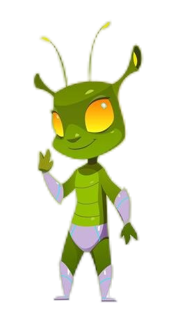

## Overview

In any game, drawing basic textures to the screen is essential knowledge, whether it is for menus and background images, to 2D game textures and characters.  In this sample we will walk though the steps needed to load a texture and then render it on the screen.

## Requirements

The following texture will be used to render to the screen.



Save it to your content project and name it "**Character**" (this name will used to reference it in the project).

> [!NOTE]
> The tutorial assumes you have already [created a new MonoGame project](https://docs.monogame.net/articles/getting_started/index.html#2-creating-a-new-project) using one of the standard templates.

## To draw a sprite on screen

1. Add the texture to your Content project, as detailed in [HowTo Add Content](../content_pipeline/HowTo_GameContent_Add.md).
2. Load the textures that will be used for drawing sprites in the [Game.LoadContent](xref:Microsoft.Xna.Framework.Game#Microsoft_Xna_Framework_Game_LoadContent) method.
    In this case, the example uses the **Content** member to load a texture from the MonoGame Framework Content Pipeline.

    > [!IMPORTANT]
    > The texture must be in the project, with the same name passed to [ContentManager.Load](xref:Microsoft.Xna.Framework.Content.ContentManager#Microsoft_Xna_Framework_Content_ContentManager_Load__1_System_String_).

    ```csharp
    // The reference to the loaded sprite
    private Texture2D spriteTexture;
    // The position to draw the sprite
    private Vector2 spritePosition;

    protected override void LoadContent()
    {
        // Create a new SpriteBatch, which can be used to draw textures.
        _spriteBatch = new SpriteBatch(GraphicsDevice);
        spriteTexture = Content.Load<Texture2D>("Character");
        spritePosition = Vector2.Zero;
    }
    ```

3. In the [Game.Draw](xref:Microsoft.Xna.Framework.Game#Microsoft_Xna_Framework_Game_Draw_Microsoft_Xna_Framework_GameTime_) method, you will see a call to [GraphicsDevice.Clear](xref:Microsoft.Xna.Framework.Graphics.GraphicsDevice#Microsoft_Xna_Framework_Graphics_GraphicsDevice_Clear_Microsoft_Xna_Framework_Color_), which clears out the screen for the next frame.

4. After [GraphicsDevice.Clear](xref:Microsoft.Xna.Framework.Graphics.GraphicsDevice#Microsoft_Xna_Framework_Graphics_GraphicsDevice_Clear_Microsoft_Xna_Framework_Color_), call [SpriteBatch.Begin](xref:Microsoft.Xna.Framework.Graphics.SpriteBatch#Microsoft_Xna_Framework_Graphics_SpriteBatch_Begin_Microsoft_Xna_Framework_Graphics_SpriteSortMode_Microsoft_Xna_Framework_Graphics_BlendState_Microsoft_Xna_Framework_Graphics_SamplerState_Microsoft_Xna_Framework_Graphics_DepthStencilState_Microsoft_Xna_Framework_Graphics_RasterizerState_Microsoft_Xna_Framework_Graphics_Effect_System_Nullable_Microsoft_Xna_Framework_Matrix__) on your [SpriteBatch](xref:Microsoft.Xna.Framework.Graphics.SpriteBatch) object to ready the next batch of textures to draw.

5. Call [SpriteBatch.Draw](xref:Microsoft.Xna.Framework.Graphics.SpriteBatch#Microsoft_Xna_Framework_Graphics_SpriteBatch_Draw_Microsoft_Xna_Framework_Graphics_Texture2D_Microsoft_Xna_Framework_Vector2_Microsoft_Xna_Framework_Color_) on your [SpriteBatch](xref:Microsoft.Xna.Framework.Graphics.SpriteBatch) object, passing the texture to draw, the screen position, and the color to apply.

    > [!TIP]
    > [Color.White](xref:Microsoft.Xna.Framework.Color) is used to draw the texture without any color effects.

6. When all the sprites have been drawn, call [SpriteBatch.End](xref:Microsoft.Xna.Framework.Graphics.SpriteBatch#Microsoft_Xna_Framework_Graphics_SpriteBatch_End) on your [SpriteBatch](xref:Microsoft.Xna.Framework.Graphics.SpriteBatch) object.

    ```csharp
    protected override void Draw(GameTime gameTime)
    {
        GraphicsDevice.Clear(Color.CornflowerBlue);

        // TODO: Add your drawing code here
        _spriteBatch.Begin();
        _spriteBatch.Draw(spriteTexture, spritePosition, Color.White);
        _spriteBatch.End();

        base.Draw(gameTime);
    }
    ```

When run, you should now see the character drawn in the top-left of the screen.

> [!NOTE]
> Actually, what you should see is the character drawn from the top-left of the screen.  This is because (by default) the Top-Left corner of the sprite is the origin and the sprite is drawn from that position.  The [Animated Sprite](HowTo_Animate_Sprite.md) example shows a simple way of offsetting the drawing of a sprite so that its middle is used as its origin instead.

## Moving the sprite

To move the sprite, simply update the `spritePosition` to a new location, a quick and easy way to do this would be to detect when the arrow keys are pressed and change the position, like so:

```csharp
    protected override void Update(GameTime gameTime)
    {
        if (GamePad.GetState(PlayerIndex.One).Buttons.Back == ButtonState.Pressed || Keyboard.GetState().IsKeyDown(Keys.Escape))
            Exit();

        // TODO: Add your update logic here
        KeyboardState state = Keyboard.GetState();
        if (state.IsKeyDown(Keys.Right))
        {
            spritePosition.X += 1;
        }
        if (state.IsKeyDown(Keys.Left))
        {
            spritePosition.X -= 1;
        }
        if (state.IsKeyDown(Keys.Up))
        {
            spritePosition.Y -= 1;
        }
        if (state.IsKeyDown(Keys.Down))
        {
            spritePosition.Y += 1;
        }

        base.Update(gameTime);
    }
```

See [How to detect input](../input/index.md) for more information on working with the various inputs that MonoGame supports.

## See Also

- [How to tint a sprite](HowTo_Tint_Sprite.md)
- [How to rotate a sprite](HowTo_Rotate_Sprite.md)
- [How to scale a sprite](HowTo_Scale_Sprite.md)
- [How to animate a sprite](HowTo_Animate_Sprite.md)

### Concepts

- [What Is a Sprite?](../../whatis/graphics/WhatIs_Sprite.md)

### Reference

- [SpriteBatch](xref:Microsoft.Xna.Framework.Graphics.SpriteBatch)
- [SpriteBatch.Draw](xref:Microsoft.Xna.Framework.Graphics.SpriteBatch#Microsoft_Xna_Framework_Graphics_SpriteBatch_Draw_Microsoft_Xna_Framework_Graphics_Texture2D_Microsoft_Xna_Framework_Vector2_Microsoft_Xna_Framework_Color_)
- [Texture2D](xref:Microsoft.Xna.Framework.Graphics.Texture2D)

(Character by `upklyak` from [FreePik](https://www.freepik.com/free-vector/cartoon-alien-character-animation-sprite-sheet_33397951.htm))
