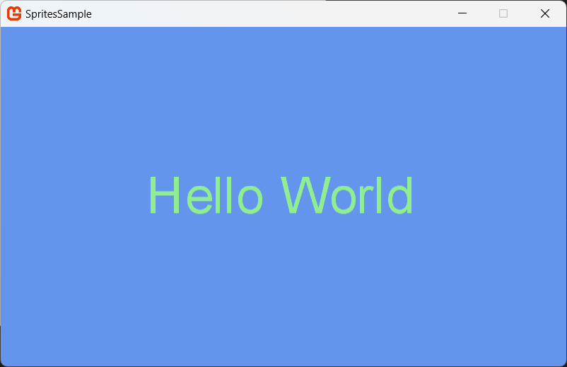

## Overview

MonoGame provides a quick and easy method for drawing text using any registered Font file installed on the development PC, this is not needed in the final game as the true type font is converted into a texture for rendering, making the process easy and seamless.

### End result



## Adding a Sprite Font and Drawing Text

1. Open your `Content.mgcb` file using the `MGCB Editor` and click **New Item** Button.

1. In the **Add New Item** dialog box, select **SpriteFont Description** and set the filename to "**MyMenuFont**" in the edit box at the top of the dialog.

    > [!NOTE]
    > You may find it convenient at this point to change the name of the new file from "Spritefont1" to the friendly name of the font you intend to load (keeping the .spritefont file extension). The friendly name identifies the font once it is installed on your computer, for example, `Courier New` or `Times New Roman`. When you reference the font in your code, you must use the friendly name you have assigned it.
    Pipeline tool creates a new `.spritefont` file for your font.

1. Double-click on your new font file in the `MGCB Editor` which will open the `SpriteFont` text file in your default editor.  Alternatively, you can **right-click** and select `Open With` to choose a different editor.

1. By default the font `Arial` will be used by the `SpriteFont` configuration, to change this to another installed font simply type the friendly name of the font to load into the `FontName` element.  For the purposes of this tutorial, I have set the Font size to **54** and left the rest of the `SpriteFont` settings as the default.

    > [!IMPORTANT]
    > This is not the name of a font file, but rather the name that identifies the font once it is installed on your computer.
    >
    > You can view the installed fonts on your machine in the `Settings -> Personalization -> Fonts` configuration on your Windows machine (or relevant place on Mac /Linux) or to install new ones.

  The content pipeline supports the same fonts as the [System.Drawing.Font](http://msdn.microsoft.com/en-us/library/system.drawing.font.aspx) class, including TrueType fonts, but not bitmap (.fon) fonts. You may find it convenient to save the new `.spritefont` file using this friendly name. When you reference the font in your code, you must use the friendly name you have assigned it.

    > [!NOTE]
    > If you want to use a custom font, you should put the `.ttf` or `.oft` in the same directory as the `.spritefont` file and the build system will pick it up. There is no need to install the font system wide.

1. If necessary, change the `Size` entry to the point size you desire for your font.

1. If necessary, change the `Style` entry to the style of font to import.
   You can specify **Regular**, **Bold**, **Italic**, or **Bold, Italic**. The **Style** entry is case sensitive.

1. Specify the character regions to import for this font.

    > [!NOTE]
    > Character regions specify which characters in the font are rendered by the [SpriteFont](xref:Microsoft.Xna.Framework.Graphics.SpriteFont). You can specify the start and end of the region by using the characters themselves, or by using their decimal values with an &# prefix. The default character region includes all the characters between the space and tilde characters, inclusive.

### To draw text on the screen

1. Add a Sprite Font to your project as described above.

1. Create a [SpriteFont](xref:Microsoft.Xna.Framework.Graphics.SpriteFont) reference to encapsulate the imported font.

1. Create a [SpriteBatch](xref:Microsoft.Xna.Framework.Graphics.SpriteBatch) object for drawing the font on the screen.

1. In your [Game.LoadContent](xref:Microsoft.Xna.Framework.Game#Microsoft_Xna_Framework_Game_LoadContent) method, call [ContentManager.Load](xref:Microsoft.Xna.Framework.Content.ContentManager#Microsoft_Xna_Framework_Content_ContentManager_Load__1_System_String_), specifying the [SpriteFont](xref:Microsoft.Xna.Framework.Graphics.SpriteFont) class and the asset name of the imported font.

1. Create your [SpriteBatch](xref:Microsoft.Xna.Framework.Graphics.SpriteBatch) object, passing the current [GraphicsDevice](xref:Microsoft.Xna.Framework.Graphics.GraphicsDevice).

    ```csharp
        // The Sprite Font reference to draw with
        SpriteFont font1;

        // The position to draw the text
        Vector2 fontPos;
        
        protected override void LoadContent()
        {
            // Create a new SpriteBatch, which can be used to draw textures.
            _spriteBatch = new SpriteBatch(GraphicsDevice);
            font1 = Content.Load<SpriteFont>("MyMenuFont");
            Viewport viewport = _graphics.GraphicsDevice.Viewport;
            
            // TODO: Load your game content here            
            fontPos = new Vector2(viewport.Width / 2, viewport.Height / 2);
            }
    ```

1. In your [Game.Draw](xref:Microsoft.Xna.Framework.Game#Microsoft_Xna_Framework_Game_Draw_Microsoft_Xna_Framework_GameTime_) method, call [SpriteBatch.Begin](xref:Microsoft.Xna.Framework.Graphics.SpriteBatch#Microsoft_Xna_Framework_Graphics_SpriteBatch_Begin_Microsoft_Xna_Framework_Graphics_SpriteSortMode_Microsoft_Xna_Framework_Graphics_BlendState_Microsoft_Xna_Framework_Graphics_SamplerState_Microsoft_Xna_Framework_Graphics_DepthStencilState_Microsoft_Xna_Framework_Graphics_RasterizerState_Microsoft_Xna_Framework_Graphics_Effect_System_Nullable_Microsoft_Xna_Framework_Matrix__) on the [SpriteBatch](xref:Microsoft.Xna.Framework.Graphics.SpriteBatch) object.

1. If necessary, determine the origin of your text.

   If you want to draw your text centered on a point, you can find the center of the text by calling [SpriteFont.MeasureString](xref:Microsoft.Xna.Framework.Graphics.SpriteFont#Microsoft_Xna_Framework_Graphics_SpriteFont_MeasureString_System_String_) and dividing the returned vector by 2.

1. Call [SpriteBatch.DrawString](xref:Microsoft.Xna.Framework.Graphics.SpriteBatch#Microsoft_Xna_Framework_Graphics_SpriteBatch_DrawString_Microsoft_Xna_Framework_Graphics_SpriteFont_System_String_Microsoft_Xna_Framework_Vector2_Microsoft_Xna_Framework_Color_) to draw your output text, specifying the [SpriteFont](xref:Microsoft.Xna.Framework.Graphics.SpriteFont) object for the font you want to use.
  
   All other parameters of [SpriteBatch.DrawString](xref:Microsoft.Xna.Framework.Graphics.SpriteBatch#Microsoft_Xna_Framework_Graphics_SpriteBatch_DrawString_Microsoft_Xna_Framework_Graphics_SpriteFont_System_String_Microsoft_Xna_Framework_Vector2_Microsoft_Xna_Framework_Color_) produce the same effects as a call to [SpriteBatch.Draw](xref:Microsoft.Xna.Framework.Graphics.SpriteBatch#Microsoft_Xna_Framework_Graphics_SpriteBatch_Draw_Microsoft_Xna_Framework_Graphics_Texture2D_Microsoft_Xna_Framework_Vector2_Microsoft_Xna_Framework_Color_).

1. Call [SpriteBatch.End](xref:Microsoft.Xna.Framework.Graphics.SpriteBatch#Microsoft_Xna_Framework_Graphics_SpriteBatch_End) after all text is drawn.

    ```csharp
    protected override void Draw(GameTime gameTime)
    {
        GraphicsDevice.Clear(Color.CornflowerBlue);
    
        _spriteBatch.Begin();
    
        // Draw Hello World
        string output = "Hello World";
    
        // Find the center of the string
        Vector2 FontOrigin = font1.MeasureString(output) / 2;
        // Draw the string
        _spriteBatch.DrawString(font1, output, fontPos, Color.LightGreen,
            0, FontOrigin, 1.0f, SpriteEffects.None, 0.5f);
    
        _spriteBatch.End();
        base.Draw(gameTime);
    }
    ```

## See Also

- [Drawing a Sprite](HowTo_Draw_A_Sprite.md)  

### Concepts

- [What Is a Sprite?](../../whatis/graphics/WhatIs_Sprite.md)

### Reference

- [SpriteBatch](xref:Microsoft.Xna.Framework.Graphics.SpriteBatch)
- [SpriteBatch.DrawString](xref:Microsoft.Xna.Framework.Graphics.SpriteBatch#Microsoft_Xna_Framework_Graphics_SpriteBatch_DrawString_Microsoft_Xna_Framework_Graphics_SpriteFont_System_String_Microsoft_Xna_Framework_Vector2_Microsoft_Xna_Framework_Color_)  
- [SpriteFont](xref:Microsoft.Xna.Framework.Graphics.SpriteFont)
- [ContentManager.Load](xref:Microsoft.Xna.Framework.Content.ContentManager#Microsoft_Xna_Framework_Content_ContentManager_Load__1_System_String_)
