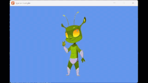

## Overview

Rotating images and sprites is easy enough, but the main thing to keep in mind is that the origin (drawing point) of textures is actually the top-left of the image, corresponding with the starting drawing point which is the top-left of the screen (for 2D anyway).

This guide walks you through calculating a new origin for images (the center in this case) and using that to determine to draw and rotate your sprite from.

### End result



## Drawing a Rotated Sprite

1. Follow the procedures of [Drawing a Sprite](HowTo_Draw_A_Sprite.md).

2. Determine the screen location of the sprite, and the point within the texture that will serve as the origin.
   By default, the origin of a texture is (0,0), the upper-left corner. When you draw a sprite, the origin point in the texture is placed on the screen coordinate specified by the `spritePosition` parameter (from the top-left hand corner of the screen).  In this example, the origin has been calculated as the center of the texture, and the screen position is the center of the screen.

   Add the following properties and update your [Game.LoadContent](xref:Microsoft.Xna.Framework.Game#Microsoft_Xna_Framework_Game_LoadContent) method as follows:

    ```csharp
    private Texture2D spriteTexture;
    private Vector2 spritePosition;
    private Vector2 spriteOrigin;
    protected override void LoadContent()
    {
        // Create a new SpriteBatch, which can be used to draw textures.
        spriteBatch = new SpriteBatch(GraphicsDevice);
        spriteTexture = Content.Load<Texture2D>("Character");

        // Get the viewport to determine the drawable space on screen.
        Viewport viewport = _graphics.GraphicsDevice.Viewport;

        // Set the Texture origin to be the center of the texture.
        spriteOrigin.X = spriteTexture.Width / 2;
        spriteOrigin.Y = spriteTexture.Height / 2;

        // Set the position of the texture to be the center of the screen.
        spritePosition.X = viewport.Width / 2;
        spritePosition.Y = viewport.Height / 2;
    }
    ```

3. In your [Game.Update](xref:Microsoft.Xna.Framework.Game#Microsoft_Xna_Framework_Game_Update_Microsoft_Xna_Framework_GameTime_) method, determine the rotation angle to use for the sprite.

   The angle is specified in radians, and it can be greater than two times `π`, but does not need to be.

    ```csharp
    // The angle at which to rotate and draw the sprite at
    private float rotationAngle;

    protected override void Update(GameTime gameTime)
    {
        if (GamePad.GetState(PlayerIndex.One).Buttons.Back == ButtonState.Pressed || Keyboard.GetState().IsKeyDown(Keys.Escape))
            Exit();

        // The time since Update was called last.
        float elapsed = (float)gameTime.ElapsedGameTime.TotalSeconds;
    
        // TODO: Add your game logic here.
        // Simple roation logic to rotate the sprite in a clockwise direction over time
        rotationAngle += elapsed;
        float circle = MathHelper.Pi * 2;
        rotationAngle %= circle;

        base.Update(gameTime);
    }
    ```

4. In your [Game.Draw](xref:Microsoft.Xna.Framework.Game#Microsoft_Xna_Framework_Game_Draw_Microsoft_Xna_Framework_GameTime_) method, call [SpriteBatch.Draw](xref:Microsoft.Xna.Framework.Graphics.SpriteBatch#Microsoft_Xna_Framework_Graphics_SpriteBatch_Draw_Microsoft_Xna_Framework_Graphics_Texture2D_Microsoft_Xna_Framework_Vector2_Microsoft_Xna_Framework_Color_) with the `texture`, `angle`, `screen position`, and `origin` of the texture.

    > We do not need to specify a value for the `sourceRectangle` in this instance, so it is set to `null`. This is used to only draw a section of a texture, to see this in action check the [How to animate a sprite](HowTo_Animate_Sprite.md) guide.

    ```csharp
    protected override void Draw(GameTime gameTime)
    {
        GraphicsDevice.Clear(Color.CornflowerBlue);

        // TODO: Add your drawing code here
        _spriteBatch.Begin();
        // Draw call updated to use a different overload with additional parameters, specifically the "Rotation angle" and "Origin".
        _spriteBatch.Draw(spriteTexture, spritePosition, null, Color.White, rotationAngle,
            spriteOrigin, 1.0f, SpriteEffects.None, 0f);
        _spriteBatch.End();

        base.Draw(gameTime);
    }
    ```

5. When all the sprites have been drawn, call [SpriteBatch.End](xref:Microsoft.Xna.Framework.Graphics.SpriteBatch#Microsoft_Xna_Framework_Graphics_SpriteBatch_End) on your [SpriteBatch](xref:Microsoft.Xna.Framework.Graphics.SpriteBatch) object.

    You should now see a rotating image in the center of the screen, rotating around the center of the image.  For fun, just try rotating the image WITHOUT using the sprite's origin and see what happens.

## See Also

- [Drawing a Sprite](HowTo_Draw_A_Sprite.md)

### Concepts

- [What Is a Sprite?](../../whatis/graphics/WhatIs_Sprite.md)

### Reference

- [SpriteBatch](xref:Microsoft.Xna.Framework.Graphics.SpriteBatch)
- [SpriteBatch.Draw](xref:Microsoft.Xna.Framework.Graphics.SpriteBatch#Microsoft_Xna_Framework_Graphics_SpriteBatch_Draw_Microsoft_Xna_Framework_Graphics_Texture2D_Microsoft_Xna_Framework_Vector2_Microsoft_Xna_Framework_Color_)
- [Texture2D](xref:Microsoft.Xna.Framework.Graphics.Texture2D)
