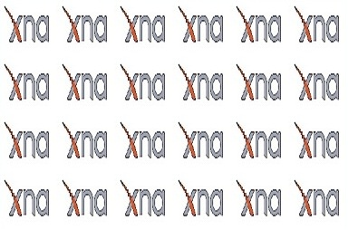

## Overview

This sample uses a texture addressing mode to duplicate a texture across the area defined by [SpriteBatch.Draw](xref:Microsoft.Xna.Framework.Graphics.SpriteBatch#Microsoft_Xna_Framework_Graphics_SpriteBatch_Draw_Microsoft_Xna_Framework_Graphics_Texture2D_Microsoft_Xna_Framework_Vector2_Microsoft_Xna_Framework_Color_). Other address modes, such as mirroring, can create interesting results.

## Requirements



## Drawing a Tiled a Sprite

1. Follow the procedures of [Drawing a Sprite](HowTo_Draw_A_Sprite.md).
2. In the [Game.Draw](xref:Microsoft.Xna.Framework.Game#Microsoft_Xna_Framework_Game_Draw_Microsoft_Xna_Framework_GameTime_) method, create a [Rectangle](xref:Microsoft.Xna.Framework.Rectangle) to define the area to fill.
3. Call [SpriteBatch.Begin](xref:Microsoft.Xna.Framework.Graphics.SpriteBatch#Microsoft_Xna_Framework_Graphics_SpriteBatch_Begin_Microsoft_Xna_Framework_Graphics_SpriteSortMode_Microsoft_Xna_Framework_Graphics_BlendState_Microsoft_Xna_Framework_Graphics_SamplerState_Microsoft_Xna_Framework_Graphics_DepthStencilState_Microsoft_Xna_Framework_Graphics_RasterizerState_Microsoft_Xna_Framework_Graphics_Effect_System_Nullable_Microsoft_Xna_Framework_Matrix__) to set the sprite state.

   The destination [Rectangle](xref:Microsoft.Xna.Framework.Rectangle) can be any size. In this example, the width and height of the destination rectangle are integer multiples of the source sprite. This will cause the sprite texture to be tiled, or drawn several times, to fill the destination area.

    ```csharp
    spriteBatch.Begin(SpriteSortMode.FrontToBack, BlendState.Opaque, SamplerState.LinearWrap,
        DepthStencilState.Default, RasterizerState.CullNone);
    ```

4. Call [SpriteBatch.Draw](xref:Microsoft.Xna.Framework.Graphics.SpriteBatch#Microsoft_Xna_Framework_Graphics_SpriteBatch_Draw_Microsoft_Xna_Framework_Graphics_Texture2D_Microsoft_Xna_Framework_Vector2_Microsoft_Xna_Framework_Color_) with the sprite, the destination rectangle, and other relevant parameters.

    ```csharp
    spriteBatch.Draw(spriteTexture, Vector2.Zero, destRect, color, 0, Vector2.Zero, 1, SpriteEffects.None, 0);
    ```

5. Call [SpriteBatch.End](xref:Microsoft.Xna.Framework.Graphics.SpriteBatch#Microsoft_Xna_Framework_Graphics_SpriteBatch_End) on your [SpriteBatch](xref:Microsoft.Xna.Framework.Graphics.SpriteBatch) object.

    ```csharp
    spriteBatch.End();
    ```

## See Also

- [Drawing a Sprite](HowTo_Draw_A_Sprite.md)

### Concepts

- [What Is a Sprite?](../../whatis/graphics/WhatIs_Sprite.md)

### Reference

- [SpriteBatch](xref:Microsoft.Xna.Framework.Graphics.SpriteBatch)
- [SpriteBatch.Draw](xref:Microsoft.Xna.Framework.Graphics.SpriteBatch#Microsoft_Xna_Framework_Graphics_SpriteBatch_Draw_Microsoft_Xna_Framework_Graphics_Texture2D_Microsoft_Xna_Framework_Vector2_Microsoft_Xna_Framework_Color_)
- [SpriteSortMode](xref:Microsoft.Xna.Framework.Graphics.SpriteSortMode)
- [Texture2D](xref:Microsoft.Xna.Framework.Graphics.Texture2D)
